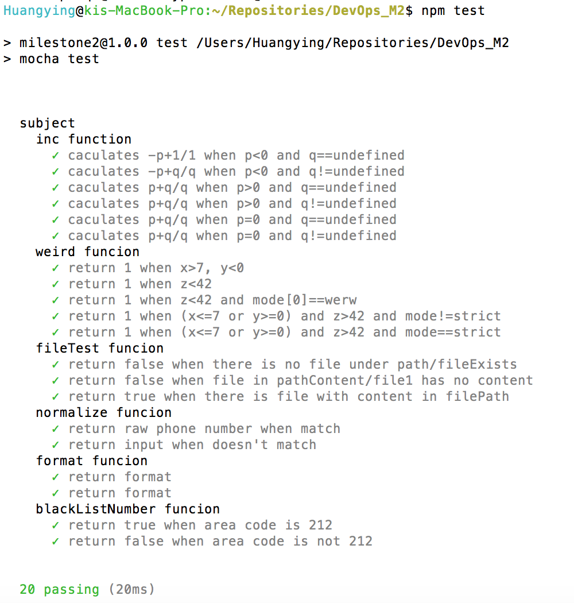
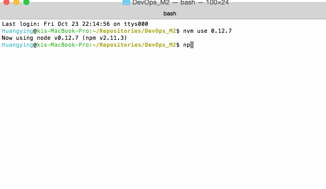
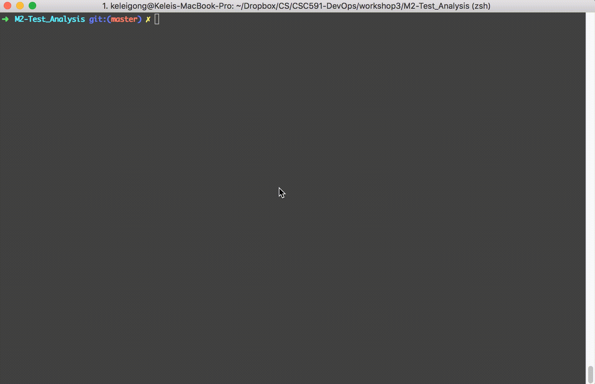

# M2-Test_Analysis
## Test Part
### Unit Test
**Setting up:**   
We use [mocha](https://mochajs.org/) and [chai](http://chaijs.com/) for unit testing. Install  using command:   

	$ npm install -g mocha     
	$ npm install chai 
Add following lines in package.json file:     
 
```
 "scripts": {   
    "test": "mocha test"   
  }
 
 "dependencies": {              
    "chai": "\*",    
    "mocha": "\*"    
    }    

``` 
       
**Testing**  
Put the `TargetTest.js` in folder `test` and use command

	$ npm test
to perform the test and show the result:



### Test Coverage

We use [istanbul](https://gotwarlost.github.io/istanbul/) to measure the coverage of test. And to improve coverage, we use the constraint-based test generation method to automatically generate more test cases. 

First by using only our unit test cases, the coverage is like this

	=============================== Coverage summary ===============================
	Statements   : 65.15% ( 43/66 )
	Branches     : 62.5% ( 30/48 )
	Functions    : 100% ( 4/4 )
	Lines        : 65.15% ( 43/66 )
	================================================================================


We use the 'generate.js' to generate more test cases, the coverage get significant improvement:

	=============================== Coverage summary ===============================
	Statements   : 84.85% ( 56/66 )
	Branches     : 81.25% ( 39/48 )
	Functions    : 100% ( 4/4 )
	Lines        : 84.85% ( 56/66 )
	================================================================================

## Analysis Part
### Static Analysis

Using [JSHint](<http://jshint.com>) for static analysis. It will scan the js file to see if there are any potential bugs or dirty codes.

There are some default rules. You can modify the `jshint.conf` file to custom the rules.

The `jshint.conf` file looks like this:

```
{
	"passfail"      : false,	// Stop on first error
	"maxerr"        : 10,		// Maximum errors before stopping
	"devel"         : true,		// Allow development statements e.g. `console.log();`
	"asi"           : false,    // Tolerate Missing Semicolon
	"maxlen"        : 80		// Maximum line length
}
```

run `jshint <filename>` will analysis the js file and output the result.

```
zsp-rmbp:M2-Test_Analysis zsp$ jshint main.js
main.js: line 4, col 9, Use '===' to compare with 'undefined'.
main.js: line 7, col 15, Use '===' to compare with '0'.
main.js: line 9, col 17, Use '===' to compare with '0'.
main.js: line 19, col 13, Use '===' to compare with '0'.
main.js: line 57, col 22, Use '===' to compare with '0'.
main.js: line 84, col 6, Unnecessary semicolon.

6 errors
```

### Extend Analysis Tool

We extend analysis tool by implementing a comment ratio calculation tool from scratch.

The new tool is a simple python file `comments_ratio.py`. It will show a result like this:

	security_checking.js - Code: 223 lines, Comment: 48 lines, Ratio:0.22%

### Security checking
To detect the presence of AWS/digital ocean security tokens, as we didn't find a way to make 100% sure that a certain string is a security token, so we use some rules to detect "suspects", and let user to decide whether to reject this commit. As the length of AWS security keys and digital ocean tokens are fixed length, 20, 40 and 64, we extract all string of these length and without whitespcae. Other rules are used to detect ssh key files, like checking the file extension, checking if it contains strings like "ssh rsa" or "PRIVATE KEY" It should work like this:

```
-----------------Running Security Checking-----------------
Files to be committed:  [ 'security_checking.js' ]

Suspects detected in security_checking.js!!
 ===> sdofhsaohgojsjsohfuqierqwtkjhehqjzlasgoijgjdifgjoiahsodfhoijwjer

Do you wish to perform this Commit? [Y/n]y
```

## Git hooks
We use git pre-commit hook to execute all the tests and analysis, and based on their performance, it will reject a commit directly or let the user to decide whether to countine this commit. It has 5 steps:

1. Run unitTest, with any fails happen, it will reject this commit.
2. Generate more test and use `istanbul` to measure test coverage. If there is any coverage below 50%, reject this commit.
3. Using JSHint to perform static analysis to all JavaScript files that are going to be committed, It will detect errors in the code, and will let user to decide whether to countine this commit.
4. Comments ratio checking, we use a python script to check the comments ratios in all JavaScript files to be committed.
5. Security checking, show all the strings that are possible to be a security token.

A full output should look like this:

```
➜  M2-Test_Analysis git:(master) ✗ git commit -m "update security checking"
--------------------Pre Commit script--------------------

--------------------Running UnitTest --------------------

> milestone2@1.0.0 test /Users/keleigong/Dropbox/CS/CSC591-DevOps/workshop3/M2-Test_Analysis
> mocha test


  subject
    inc function
      ✓ caculates -p+1/1 when p<0 and q==undefined
      ✓ caculates -p+q/q when p<0 and q!=undefined
      ✓ caculates p+q/q when p>0 and q==undefined
      ✓ caculates p+q/q when p>0 and q!=undefined
      ✓ caculates p+q/q when p=0 and q==undefined
      ✓ caculates p+q/q when p=0 and q!=undefined
    weird funcion
      ✓ return 1 when x>7, y<0
      ✓ return 1 when z<42
      ✓ return 1 when z<42 and mode[0]==werw
      ✓ return 1 when (x<=7 or y>=0) and z>42 and mode!=strict
      ✓ return 1 when (x<=7 or y>=0) and z>42 and mode==strict
    fileTest funcion
      ✓ return false when there is no file under path/fileExists
      ✓ return false when file in pathContent/file1 has no content
      ✓ return true when there is file with content in filePath
    normalize funcion
      ✓ return raw phone number when match
      ✓ return input when doesn't match
    format funcion
      ✓ return format
      ✓ return format
    blackListNumber funcion
      ✓ return true when area code is 212
      ✓ return false when area code is not 212


  20 passing (25ms)

All unit test cases passed!

------------------- Running Istanbul --------------------
Generating test cases ......
main
=============================================================================
Writing coverage object [/Users/keleigong/Dropbox/CS/CSC591-DevOps/workshop3/M2-Test_Analysis/coverage/coverage.json]
Writing coverage reports at [/Users/keleigong/Dropbox/CS/CSC591-DevOps/workshop3/M2-Test_Analysis/coverage]
=============================================================================

=============================== Coverage summary ===============================
Statements   : 91.15% ( 103/113 )
Branches     : 64.29% ( 18/28 )
Functions    : 100% ( 5/5 )
Lines        : 91.15% ( 103/113 )
================================================================================
Statements Coverage is higher than  50 % Pass!
Branches Coverage is higher than  50 % Pass!
Functions Coverage is higher than  50 % Pass!
Lines Coverage is higher than  50 % Pass!

---------Running JSHint to analyse source code ----------
security_checking.js: line 9, col 21, Use '===' to compare with '0'.
security_checking.js: line 29, col 22, Missing semicolon.
security_checking.js: line 30, col 16, 'i' is already defined.
security_checking.js: line 35, col 118, Line is too long.
security_checking.js: line 49, col 16, 'i' is already defined.
security_checking.js: line 51, col 29, Missing semicolon.
security_checking.js: line 59, col 25, 'tmp' is already defined.

7 errors
main.js: line 4, col 9, Use '===' to compare with 'undefined'.
main.js: line 7, col 15, Use '===' to compare with '0'.
main.js: line 9, col 17, Use '===' to compare with '0'.
main.js: line 19, col 13, Use '===' to compare with '0'.
main.js: line 57, col 22, Use '===' to compare with '0'.
main.js: line 84, col 6, Unnecessary semicolon.

6 errors
JsHint errors in source file!
Do you wish to continue this Commit? [Y/n]y

-------------Running Comments Ratio Checking---------------
security_checking.js - Code: 223 lines, Comment: 48 lines, Ratio:0.22%

-----------------Running Security Checking-----------------
Files to be committed:  [ 'security_checking.js', 'main.js' ]

Suspects detected in security_checking.js!!
 ===> sdofhsaohgojsjsohfuqierqwtklasgoijgjdifgjoiahsodfhoijwjer

Do you wish to perform this Commit? [Y/n]y
[master 2ac9f1e] update security checking
 2 file changed, 6 insertions(+), 1 deletion(-)
 
```

## Screencasts
A successful commit:


A rejected commit because of failed unit test:



A rejected commit when coverage below 50%:



Decide whether to reject a commit when JSHint finds errors: [video](https://drive.google.com/file/d/0B87f7178bIHnR2gwYjBrUGpyYlE/view?usp=sharing)

Decide whether to reject a commit when security tokens detected: [video](https://drive.google.com/file/d/0B87f7178bIHnNkdacXRlS1ZMNVU/view?usp=sharing)


