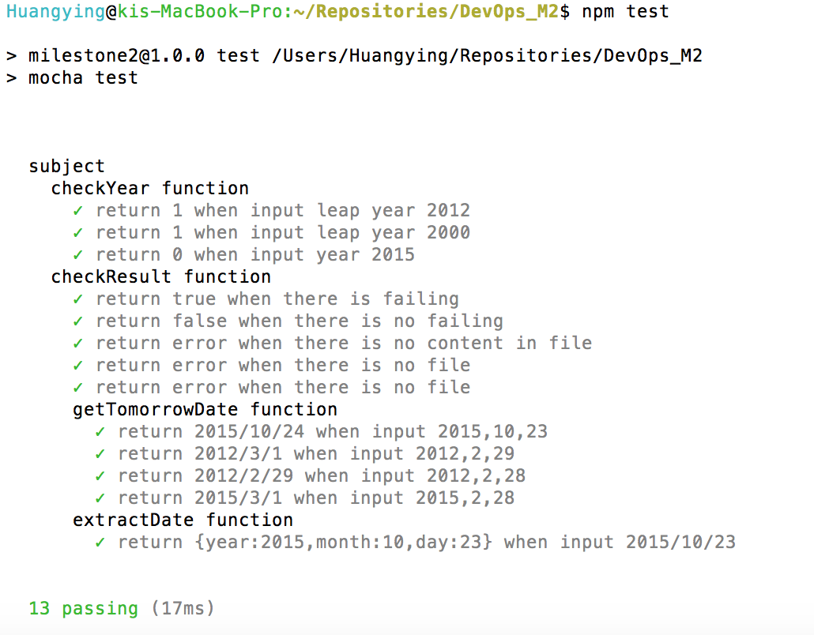

# M2-Test_Analysis
## Unit Test
**Setting up:**   
`npm install -g mocha`      
`npm install chai`       
`mkdir test`  
`touch test/test.js`    
add following lines in package.json file:     
 "scripts": {   
    "test": "mocha test"   
  }
 
 "dependencies": {              
    "chai": "\*",    
    "mocha": "\*"    
    }
    

**Write unit tests:**    
In test/test.js file, we wrote 20 unit test for subject.js   
**Unit test report:**   
run `npm test`  to get the report:   

**Extract the result:**  
write main.js to parse the report and extract the result.    
run `node main.js` will tell the result if all unit tests passed:

